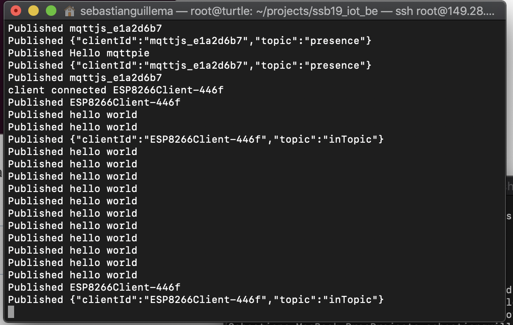

# Sprints
---
This is a collection of blog entries in regards to the agile methodology of sprints for Summer Studio B.

The workload is split into 4 sprints where we focus on devlopment and executing on a goal each week.
In this section of my portfolio, I will outline my progress, experience, and development of my myself and my team each week, with artefacts as evidence.

**_Monday, the 4th of Feburary_**: Orientation where we are briefed on the subject outline

**_Friday, the 1st of March_**: Final day where we present what we worked on in Summer Studio B

## Sprint 1

This was an exciting week for the takeoff for summer studio B, after some intial design thinking exercises and a pizza lunch, we were off to our first class.
Monday was a great start, we introduced ourselves and began working on our [IoT Data Logger](http://iot.nortcele.win/doc/index.html). We were provided with a PCB each, we got to choose the colour, and from there we began constructing our device. The PCB we recieved was similar to a board that was used to monitor the integrity and quality of powerlines throughout
Sydney by our coordinator in a real worl scenario. There are thousands of these placed around Sydney for live data tracking and we'll be using it's clone to do our 
IoT setup. We spent the afternoon soldering and testing our PCB for the rest of the week.

After we had our boards, fully soldered and ready to go, we started to test our boards and understand how they work. This was done with the [Blynk](https://www.blynk.cc/) App which allows me to use my phone to talk to the device to read some viritual pins connected to various sensors. For example I can see the light level in the room I am in by connecting to the pin assigned to that sensor. This was done by following the tutorial at [iot.nortvele.win](http://iot.nortcele.win/docs) where we went through the steps to make our device work.

***
#### Project definition
> We then spent time on conceptualising a solution to a problem we experience with our new IoT devices., the key question of this week is:
> <br/><br/>
> **_"What problem are we solving?"_** 
> <br/><br/>
> Me and my group have decided to work on plant life monitoring because of the neglect that occurs specfically in office settings. There are currently available solutions for plants to be monitored using IoT technlogy, but they require a lot of maintainence themselves in the form of batteries. The get around this people usally plug in their IoT monitored plants, but If someone was going to have maybe 5-6 small plants on their desk or so, having 5-6 available power sockets can be anoying. So the other part of the problem has come to be a modular design to reduce the footprint of the technology.

***
The rest of the week we spent time working on setting up our portfolio *(What you're currently reading)* and a design concept for our solution to our defined problem. This portfolio
is using a documentation framework called [Vuepress](https://vuepress.vuejs.org) which is perfect for creating stylish websites or blogs on the fly and allow for quick blog development. To aid that my portfolio is
using a service called [Netlify](https://netlify.com) which allows for easy deployment and setup from the world of DevOps. I can't take the credit here as my fellow student and team member who I'll be working with on my project, [Sebastian](https://sebastian.summerstudio.xyz), help me set this all up. He created a template for the portfolio which me and some other students have forked for their own profiles and customised to our liking. This site is hosted at <https://callum.summerstudio.xyz> 

The basics of my teams design is 3D printed plant pots that have [soil sensors](http://www.circuitstoday.com/arduino-soil-moisture-sensor) in them that can be connected to eachother via 6-pin magnetic connectors which also carry a signal from an Arduino controller mounted on the end of one of the pots. We plan to be able to hold 6+ pots from one Arduino controller using the connectors, but for now we will try and make it work with 2 or 3.
My team has decided we we have an abundance of some WiFi microcontroller units, the [ESP8266](https://arduino-esp8266.readthedocs.io/en/latest/index.html), so I will be using these for the logic of our plants pots and standard [soil sensors](http://www.circuitstoday.com/arduino-soil-moisture-sensor) will do just the trick. The chips will be programmed to respond to a certain signal from the Arduino which will then send the feedback of the soil moisture level for live data processing. The hub connector for the Arduino will have a light sensors as well to log the lumisoity so that the plants can be moved if they need more light.
As the design evolves, being able to add in LED's and even a self watering system when the moisture level hits a threshold are both great future milestones.

I event wrote some code to simulate reading multiple sesnors for now. Very basic, but it got the job done. Swap LEDS for sensors and inputs and you're good to go!
```javascript
int LED_1 = 11;
int LED_2 = 12;
int LED_3 = 13;

void setup() {
  // put your setup code here, to run once:
  pinMode(LED_1, OUTPUT);
  pinMode(LED_2, OUTPUT);
  pinMode(LED_3, OUTPUT);
}

void loop() {
  // put your main code here, to run repeatedly:
  digitalWrite(LED_1, HIGH);
  delay(1000);
  digitalWrite(LED_1, LOW);
  digitalWrite(LED_2, HIGH);
  delay(1000);
  digitalWrite(LED_2, LOW);
  digitalWrite(LED_3, HIGH);
  delay(1000);
  digitalWrite(LED_3, LOW);
}
```

After setting up alot of the base for the project, we were tasked to see if we could send data from our devices to the cloud. This is done with a [MQTT Broker](http://mqtt.org/) service as a message handler for our devices. Other students have opted to use the Blynk App that we used for testing our boards. I have opted to make an MQTT communicating board as we can avoid a lot of the bloat assdociated with the Blynk app and allows us to handle the data our own way, were as the Blynk app everything is set up using events and manual inputs. This was the easier choice of the two, however I made the MQTT code to run off the device and have helped other students to do the same.

This was done by creating a hotspot on my phone that the device can use for internet, with code written in C .... to connect to the MQTT service configured with constants. To see the messages that would be sent off, we can just look at the serial communications that are sent.

```javascript
  WiFi.begin("Callum's iPhone", "*****");

  Serial.begin(9600);
  Serial.println(analogRead(SENSOR_PIN));

  //Output 
  //Sensor : 123
```

Once a connection is established, it's as simple as sending a message to a topic and on the MQTT side looking for the message. The MQTT Broker service was developed by Sebastian who already tested the code locally using [Mosca](https://github.com/mcollina/mosca) which is a Node.js instance for local development. He then set this up on the [Vultr](https://www.vultr.com/) infrasturtcure service provided to use by the studio if we ever needed to host something, and has allowed all the students to publish data to the service for handling.

```javascript
  client.publish(topic, msg);
```
[Example using PubSubClient](https://github.com/knolleary/pubsubclient/blob/master/examples/mqtt_esp8266/mqtt_esp8266.ino)

The device connects to an MQTT Broker and publishes dummy data to the service, it does this with the ESP8266 chip. It's as simple as connecting the client and publishing a message to a topic. This was achieved with a library for the [ESP8266](https://arduino-esp8266.readthedocs.io/en/latest/esp8266wifi/readme.html) and the [PubSub](https://github.com/knolleary/pubsubclient/) library

<div class="center-image"> 



</div>

In the next sprint, I hope me and my team can get a hardwired working prototype for our system, or even a proper working model for our design so we can start designing the 3D container by then end of the sprint.

***


#### Artefacts
> The components we will be using
> <br/>
> 

> A rough sketch of how the system will work 
> <br/>
> 
  
> My portfolio repository
> <br/>
> <https://github.com/callummcmaugh/ssb19_iot_portfolio>

## Sprint 2

This week I needed to make more of a working prototype for my project, so I need to setup the MQTT services on the device as well as sending new analog data. This time I will go through the steps on how I was able to get the setup, as well as changing one of the IoT Data Logger boards to be used with 2 soil sensors.

Things to do:
- Wire up analog reader to soil sensors
- GP14 high low to switch between analog sensors
- MQTT Broker for data?

Soldered together a different board with the ESP connected already so i can do analog reading.

install library for board and pubsub stuff
https://learn.adafruit.com/adafruit-huzzah-esp8266-breakout/using-arduino-ide

install c341 driver for the usb config
look at screenshot for toolof arduino upload
I halved the transfer rate so it would be quicker

Basic version https://arduino-esp8266.readthedocs.io/en/latest/esp8266wifi/readme.html

Pin 14 is used to switch the multiplexor to different analog reads
Sesnor pin is a0

https://pubsubclient.knolleary.net/index.html use this for the code to put on the ESP.

Edited the code to have different sub and pub settings

```javascript
#include <ESP8266WiFi.h>
#include <PubSubClient.h>

WiFiClient espClient;
PubSubClient client(espClient);

void setup() {
  connectWiFi(); //Connect to the wifi
  client.setServer(mqtt_server, 1883); //Sets up the MQTT Server
}
void loop() {
  if (!client.connected()) {
    reconnect();
  }
  client.loop();

  long current_time = millis();
  if (current_time - lastMsg > 2000) {
    lastMsg = current_time;
    client.publish(Soil_Sensor_2_Topic, msg);
  }
}
```

Began to make it publish two messages


Day 2

Setup AWS to host some services.
MQTT deployed to the AWS Server to listen for requests
API development to interact with database

## Sprint 3

## Sprint 4