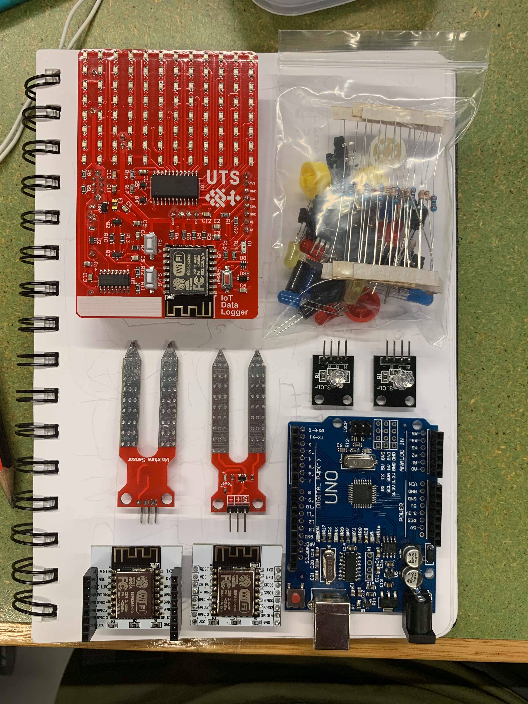
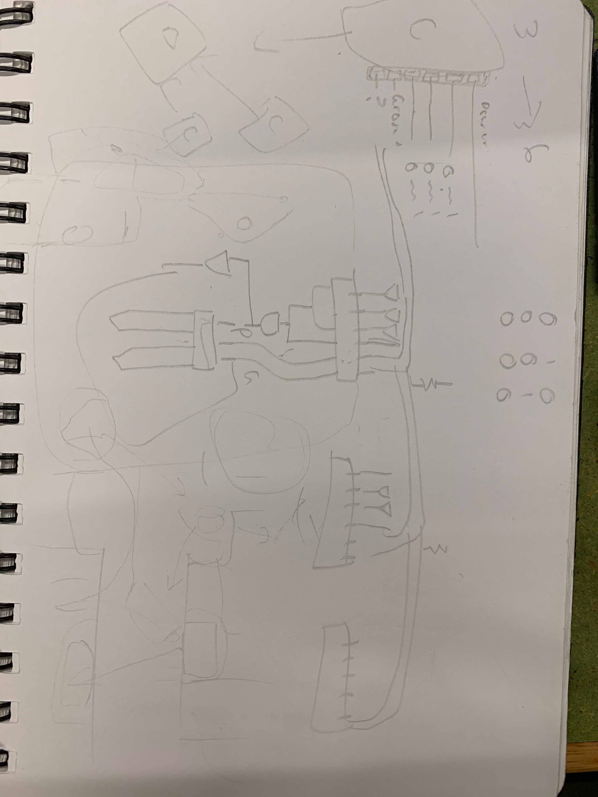

# Sprints
---
This is a collection of blog entries in regards to the agile methodology of sprints for Summer Studio B.

The workload is split into 4 sprints where we focus on devlopment and executing on a goal each week.
In this section of my portfolio, I will outline my progress, experience, and development of my myself and my team each week, with artefacts as evidence.

**_Monday, the 4th of Feburary_**: Orientation where we are briefed on the subject outline

**_Friday, the 1st of March_**: Final day where we present what we worked on in Summer Studio B

## Sprint 1

This was an exciting week for the takeoff for summer studio B, after some intial design thinking exercises and a pizza lunch, we were off to our first class.
Monday was a great start, we introduced ourselves and began working on our [IoT Data Logger](http://iot.nortcele.win/doc/index.html). We were provided with a PCB each, we got to choose the colour, and from there we began constructing our device. The PCB we recieved was similar to a board that was used to monitor the integrity and quality of powerlines throughout
Sydney by our coordinator in a real worl scenario. There are thousands of these placed around Sydney for live data tracking and we'll be using it's clone to do our 
IoT setup. We spent the afternoon soldering and testing our PCB for the rest of the week.

What we then began to work on was conceptualising a pproblem that could be solved, the key question of this week is **_"What problem are we solving?"_**, and it fits in nicely here.
Me and my group have decided to work on plant life monitoring because oft the neglect that occurs specfically in office settings. There are currently available solutions for plants to
be monitored using IoT technlogy, but they require a lot of maintainence themselves in the form of batteries. The get around this people usally plug in their IoT monitored plants, but If someone was going to have maybe 5-6 small plants on their desk or so, having 5-6 available power sockets can be anoying. So the other part of the problem has come to be a modular design to reduce the footprint of the technology.

The rest of the week we spent time working on setting up our portfolio *(What you're currently reading)* and a design concept for our solution to our defined problem. This portfolio
is using a documentation framework called [Vuepress](https://vuepress.vuejs.org) which is perfect for creating stylish websites or blogs on the fly and allow for quick blog development. To aid that my portfolio is
using a service called [Netlify](https://netlify.com) which allows for easy deployment and setup from the world of DevOps. I can't take the credit here as my fellow student and team member who I'll be working with on my project, [Sebastian](https://sebastian.summerstudio.xyz), help me set this all up. He created a template for the portfolio which me and some other students have forked for their own profiles and customised to our liking. This site is hosted at <https://callum.summerstudio.xyz> 

The basics of my teams design is 3D printed plant pots that have [soil sensors](http://www.circuitstoday.com/arduino-soil-moisture-sensor) in them that can be connected to eachother via 6-pin magnetic connectors which also carry a signal from an Arduino controller mounted on the end of one of the pots. We plan to be able to hold 6+ pots from one Arduino controller using the connectors, but for now we will try and make it work with 2 or 3.
My team has decided we we have an abundance of some WiFi microcontroller units, the [ESP8266](https://arduino-esp8266.readthedocs.io/en/latest/index.html), so I will be using these for the logic of our plants pots and standard [soil sensors](http://www.circuitstoday.com/arduino-soil-moisture-sensor) will do just the trick. The chips will be programmed to respond to a certain signal from the Arduino which will then send the feedback of the soil moisture level for live data processing. The hub connector for the Arduino will have a light sensors as well to log the lumisoity so that the plants can be moved if they need more light.
As the design evolves, being able to add in LED's and even a self watering system when the moisture level hits a threshold are both great future milestones.

In the next sprint, I hope me and my team can get a hardwired working prototype for our system, or even a proper working model for our design so we can start designing the 3D container by then end of the spring.

#### Artefacts
> The components we will be using
>  
> 

> A rough sketch of how the system will work 
>  
> 
  
> My portfolio repository
>  
> <https://github.com/callummcmaugh/ssb19_iot_portfolio>

## Sprint 2

## Sprint 3

## Sprint 4